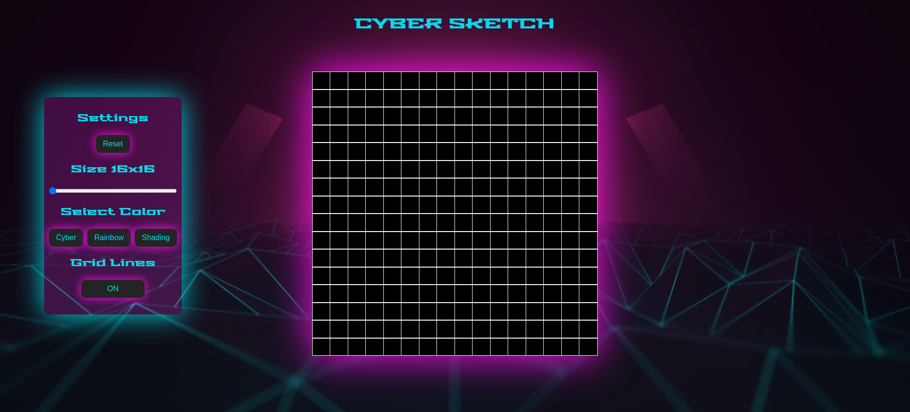

# Cyber-Sketch

> Etch-a-Sketch project with extensive DOM manipulation

## Table of contents

- [Overview](#overview)
  - [Features](#features)
  - [Screenshot](#screenshot)
  - [Links](#links)
- [My process](#my-process)
  - [Built with](#built-with)
- [Author](#author)

## Overview

### Features

- [x] Dynamically rendered grid scaling based on setting
- [x] Drawing with mousover on the grid cells
- [x] Change the color with which you draw with
- [x] Reset the sketch to the original state

### Screenshot

### Links

> View the project [here](https://funkosaur.github.io/Cyber-Sketch/)

## My process

### Built with

- HTML5
- CSS
- Flexbox
- CSS Grid
- Desktop-first workflow
- Javascript

## Author

- Website - [Mario Boykovski](https://github.com/funkosaur)